# OrderItem — schema view

> Detailed schema for the **[OrderItem](../order-item.md)** entity. The card has the mental model; this is the column-level reference. Authoritative source: [`schema.prisma:1844`](../../../admin-backend-api/prisma/schema.prisma#L1844) (`admin-backend-api` — source of truth).

## Diagram (entity + typed columns + relations)

*Relation labels carry cardinality and `onDelete`. Crow's-foot notation: `||`=exactly one, `o{`=zero-or-many, `o|`=zero-or-one.*

## Data dictionary
| Column | Type | Key | Null | Meaning |
|---|---|---|---|---|
| `id` | int | PK | no | Surrogate key |
| `order_id` | int | FK→Order | no | Parent order (cascade) |
| `item_type` | enum `OrderItemType` | — | no | `product` \| `subscription` \| `ppl_addon` — discriminator |
| `product_id` | int | FK→Product | yes | Set when `item_type = product` (setNull) |
| `subscription_plan_id` | int | FK→SubscriptionPlan | yes | Set when `item_type = subscription` (setNull) |
| `ppl_addon_package_id` | int | FK→PplAddonPackage | yes | Set when `item_type = ppl_addon` (setNull) |
| `show_product_id` | int | FK→ShowProduct | yes | Per-show offering this line came from (cart-originated product orders) (setNull) |
| `description` | varchar(255) | — | no | Snapshot of item name at time of purchase |
| `quantity` | int | — | no | Default 1 |
| `unit_price` | decimal(10,2) | — | no | Price per unit at purchase (snapshot) |
| `custom_unit_price` | decimal(10,2) | — | yes | Manual sales-price override frozen from the cart line (null = none) |
| `amount` | decimal(10,2) | — | no | `quantity * effective unit price` |
| `is_default_included` | boolean | — | no | True for booth's bundled/default-included items (carried from cart); default false |
| `lead_credits` | int | — | no | PPL credits granted (0 for products); default 0 |
| `created_at` / `updated_at` | timestamptz | — | no | Timestamps |

## Relations
| Related entity | Cardinality | onDelete | Meaning |
|---|---|---|---|
| [Order](../order.md) | N→1 | Cascade | Parent order |
| [Product](../product.md) | N→1 (opt) | SetNull | Product line target (`item_type = product`) |
| SubscriptionPlan | N→1 (opt) | SetNull | Subscription plan target (`item_type = subscription`) |
| [PplAddonPackage](../ppl-addon-package.md) | N→1 (opt) | SetNull | Add-on package target (`item_type = ppl_addon`) |
| [ShowProduct](../show-product.md) | N→1 (opt) | SetNull | Per-show offering origin |

*Exactly one of `product_id` / `subscription_plan_id` / `ppl_addon_package_id` is set per row — `item_type` is the discriminator. All catalog FKs are `SetNull`, so deleting a catalog row never deletes order history; the `description` / `unit_price` / `amount` snapshot survives.*

## Indexes
`order_id` — no unique constraints.

---
*Regenerate diagram: `mmdc -i order-item.mmd -o order-item.svg -b white -p pptr.json -c mermaid-config.json`*
