# Order — schema view

> Detailed schema for the **[Order](../order.md)** entity. The card has the mental model; this is the column-level reference. Authoritative source: [`schema.prisma:1532`](../../../admin-backend-api/prisma/schema.prisma#L1532) (`admin-backend-api` — source of truth).

## Diagram (entity + typed columns + relations)

*Relation labels carry cardinality and `onDelete`. Crow's-foot notation: `||`=exactly one, `o{`=zero-or-many, `o|`=zero-or-one.*

## Data dictionary
| Column | Type | Key | Null | Meaning |
|---|---|---|---|---|
| `id` | int | PK | no | Surrogate key |
| `order_number` | varchar(50) | UK | no | Human-readable ref (e.g. `ORD-2026-00001`) |
| `company_id` | int | FK→Company | no | Owning company (cascade) |
| `company_subscription_id` | int | FK→CompanySubscription | yes | Set for subscription/renewal orders; null for product/add-on (setNull) |
| `order_type` | enum `OrderType` | — | no | `subscription` \| `ppl_addon` \| `product` |
| `status` | enum `OrderStatus` | — | no | Lifecycle; default `pending` |
| `subtotal` | decimal(10,2) | — | no | Line subtotal before tax/coupon |
| `coupon_code` | varchar(100) | — | yes | Applied promo code (string snapshot) |
| `coupon_amount` | decimal(10,2) | — | no | Discount deducted; default 0 |
| `tax` | decimal(10,2) | — | no | Tax; default 0 |
| `total` | decimal(10,2) | — | no | Final payable |
| `currency` | varchar(10) | — | no | Default `usd` |
| `billing_first_name` … `billing_email` | varchar | — | yes | **11-field** checkout billing snapshot (name, company, address×2, city, state, country, zip, phone, email) |
| `stripe_payment_intent_id` | varchar(255) | UK | yes | Stripe PaymentIntent (`pi_xxx`) |
| `stripe_checkout_session_id` | varchar(255) | UK | yes | Stripe Checkout Session (`cs_xxx`) |
| `stripe_charge_id` | varchar(255) | — | yes | Stripe Charge (`ch_xxx`) for refunds |
| `quickbooks_order_id` | varchar(255) | — | yes | QuickBooks sync id |
| `quickbooks_sync_status` | enum `QuickBooksSyncStatus` | — | no | Default `pending` |
| `quickbooks_synced_at` | timestamptz | — | yes | When synced |
| `notes` | text | — | yes | Free-form |
| `payment_mode` | enum `PaymentMode` | — | no | `full` (one charge) \| `split` (N installments); default `full` |
| `installments_count` | int | — | no | Total installments; 1 for full payment |
| `paid_amount` | decimal(10,2) | — | no | Running sum of succeeded `PaymentTransaction`s; bumped by webhook |
| `paid_in_full_at` | timestamptz | — | yes | Set when `paid_amount == total` → completed |
| `sales_person_id` | int | FK→User | yes | Sales rep (restrict) |
| `cart_id` | int | FK→Cart, **UNIQUE** | yes | Cart this order came from; null for subscription/ppl_addon. Unique → one cart = one order (setNull) |
| `setup_fees` | decimal(10,2) | — | no | Booth setup fees snapshot; default 0 |
| `cleaning_fees` | decimal(10,2) | — | no | Booth cleaning fees snapshot; default 0 |
| `total_savings` | decimal(10,2) | — | no | Σ (actual − sales) deltas at order creation |
| `deleted_at` | timestamptz | — | yes | **Soft delete only** |
| `created_at` / `updated_at` | timestamptz | — | no | Timestamps |

## Relations
| Related entity | Cardinality | onDelete | Meaning |
|---|---|---|---|
| [Company](../company.md) | N→1 | Cascade | Owner |
| [CompanySubscription](../company-subscription.md) | N→1 (opt) | SetNull | Renewal origin |
| [Cart](../cart.md) | 1→1 (opt) | SetNull | Product-order origin (unique `cart_id`) |
| [User](../exhibitor.md) (salesPerson) | N→1 (opt) | Restrict | Sales rep |
| [OrderItem](../order-item.md) | 1→N | — | Line items |
| [OrderAgreement](../order-agreement.md) | 1→1 (opt) | — | Signature (immutable) |
| [Invoice](../invoice.md) | 1→N | — | Billing |
| [PaymentTransaction](../payment-transaction.md) | 1→N | — | Charges/installments |
| [GiftCertificateRedeem](../gift-certificate.md) | 1→N | — | Gift-cert redemptions (Restrict from redeem side) |
| InventoryReservation | 1→N | — | Stock consumed at signature |

*Also linked (supporting): `PPLCompanyAccountHistory`, `CouponAuditLog`.*

## Indexes
`company_id`, `company_subscription_id`, `order_type`, `status`, `quickbooks_order_id` — plus unique on `order_number`, `cart_id`, `stripe_payment_intent_id`, `stripe_checkout_session_id`.

---
*Regenerate diagram: `mmdc -i order.mmd -o order.svg -b white -p pptr.json -c mermaid-config.json`*
