# PaymentTransaction — schema view

> Detailed schema for the **[PaymentTransaction](../payment-transaction.md)** entity. The card has the mental model; this is the column-level reference. Authoritative source: [`schema.prisma:2047`](../../../admin-backend-api/prisma/schema.prisma#L2047) (`admin-backend-api` — source of truth).

## Diagram (entity + typed columns + relations)

*Relation labels carry cardinality and `onDelete`. Crow's-foot notation: `||`=exactly one, `o{`=zero-or-many, `o|`=zero-or-one.*

## Data dictionary
| Column | Type | Key | Null | Meaning |
|---|---|---|---|---|
| `id` | int | PK | no | Surrogate key |
| `order_id` | int | FK→[Order](order.md) | no | Owning order (cascade) |
| `company_id` | int | FK→[Company](company.md) | no | **Denormalized** for cron query speed (avoids join through orders); cascade |
| `installment_number` | int | — | no | 1..N within the order |
| `total_installments` | int | — | no | Snapshot of `installments_count` at order-creation time |
| `amount` | decimal(10,2) | — | no | Amount to charge for this installment |
| `currency` | varchar(10) | — | no | Default `usd` |
| `status` | enum `PaymentTransactionStatus` | — | no | `scheduled` \| `processing` \| `succeeded` \| `failed` \| `canceled` \| `refunded`; default `scheduled` |
| `stripe_payment_intent_id` | varchar(255) | UK | yes | `pi_xxx`; set when PI created. Unique → idempotency |
| `stripe_charge_id` | varchar(255) | — | yes | `ch_xxx`; from succeeded PI's `latest_charge` |
| `stripe_payment_method_id` | varchar(255) | — | no | `pm_xxx` snapshot at scheduling; cron reuses off_session |
| `stripe_customer_id` | varchar(255) | — | no | `cus_xxx` snapshot at scheduling |
| `due_date` | timestamptz | — | no | When the cron should attempt this charge (now for #1) |
| `attempted_at` | timestamptz | — | yes | Most recent attempt timestamp |
| `paid_at` | timestamptz | — | yes | Set by webhook on `payment_intent.succeeded` |
| `failure_code` | varchar(100) | — | yes | Stripe decline code (e.g. `card_declined`) |
| `failure_message` | text | — | yes | Human-readable failure reason |
| `retry_count` | int | — | no | Failed attempts so far; default 0; cron stops after 3 |
| `next_retry_at` | timestamptz | — | yes | When retry cron re-attempts (exp. backoff; NULL = no auto-retry) |
| `invoice_id` | int | FK→[Invoice](invoice.md) | yes | Set by webhook after Invoice row is created (setNull) |
| `idempotency_key` | varchar(255) | UK | no | Sent to Stripe as `Idempotency-Key` header on PI creation |
| `source` | enum `PaymentTransactionSource` | — | no | `checkout` \| `cron` \| `manual_retry` \| `subscription_renewal`; default `checkout` |
| `created_at` / `updated_at` | timestamptz | — | no | Timestamps |

## Relations
| Related entity | Cardinality | onDelete | Meaning |
|---|---|---|---|
| [Order](order.md) | N→1 | Cascade | Owning order |
| [Company](company.md) | N→1 | Cascade | Denormalized owner |
| [Invoice](invoice.md) | N→1 (opt) | SetNull | Invoice generated for this installment |

## Indexes
`(status, due_date)` (charge cron), `(status, next_retry_at)` (retry cron), `company_id`, `order_id` — plus unique on `stripe_payment_intent_id`, `idempotency_key`.

---
*Regenerate diagram: `mmdc -i payment-transaction.mmd -o payment-transaction.svg -b white -p pptr.json -c mermaid-config.json`*
