# PplAddonPackage — schema view

> Detailed schema for the **[PplAddonPackage](../ppl-addon-package.md)** entity. The card has the mental model; this is the column-level reference. Authoritative source: [`schema.prisma:1155`](../../../admin-backend-api/prisma/schema.prisma#L1155) (`admin-backend-api` — source of truth).

## Diagram (entity + typed columns + relations)

*Relation labels carry cardinality and `onDelete`. Crow's-foot notation: `||`=exactly one, `o{`=zero-or-many, `o|`=zero-or-one.*

## Data dictionary
| Column | Type | Key | Null | Meaning |
|---|---|---|---|---|
| `id` | int | PK | no | Surrogate key |
| `name` | varchar(100) | — | no | Package name; **case-insensitive unique** via functional index on `LOWER(name)` |
| `lead_credits` | int | — | no | Number of lead credits (e.g. 5, 20, 50, 100) |
| `amount` | decimal(10,2) | — | no | One-time price (e.g. 10.00, 25.00) |
| `currency` | varchar(10) | — | no | Default `usd` |
| `stripe_price_id` | varchar(255) | — | yes | Stripe Price id for checkout |
| `stripe_product_id` | varchar(255) | — | yes | Stripe Product id |
| `sort_order` | int | — | no | Display order on Lead Top-ups tab; default 0 |
| `is_active` | boolean | — | no | Default true |
| `created_at` / `updated_at` | timestamptz | — | no | Timestamps |

## Relations
| Related entity | Cardinality | onDelete | Meaning |
|---|---|---|---|
| [OrderItem](order-item.md) | 1→N | — | Order lines purchasing this add-on package |

## Indexes
Composite unique on `(lead_credits, amount)` (`ppl_addon_packages_lead_credits_amount_key`); case-insensitive unique on `LOWER(name)` via functional index.

---
*Regenerate diagram: `mmdc -i ppl-addon-package.mmd -o ppl-addon-package.svg -b white -p pptr.json -c mermaid-config.json`*
