# ProductType — schema view

> Detailed schema for the **[ProductType](../product-type.md)** entity. The card has the mental model; this is the column-level reference. Authoritative source: [`schema.prisma:1260`](../../../admin-backend-api/prisma/schema.prisma#L1260) (`admin-backend-api` — source of truth).

## Diagram (entity + typed columns + relations)

*Relation labels carry cardinality and `onDelete`. Crow's-foot notation: `||`=exactly one, `o{`=zero-or-many, `o|`=zero-or-one.*

## Data dictionary
| Column | Type | Key | Null | Meaning |
|---|---|---|---|---|
| `id` | int | PK | no | Surrogate key |
| `name` | varchar(100) | — | no | Display name (Booth, Sponsorship, …) |
| `code` | varchar(100) | UK | no | Stable machine-readable code (e.g. `booth`, `sponsor_tier_packages`) |
| `parent_type_id` | int | FK→ProductType (self) | yes | Parent category; NULL for primary/top-level types (restrict) |
| `sequence` | int | — | no | Display order within sibling group (per-scope uniqueness via partial indexes in migration; plain index here) |
| `is_active` | boolean | — | no | Active flag; default `true` |
| `deleted_at` | timestamptz | — | yes | **Soft delete only** |
| `created_at` / `updated_at` | timestamptz | — | no | Timestamps |

## Relations
| Related entity | Cardinality | onDelete | Meaning |
|---|---|---|---|
| ProductType (parent) | N→1 (opt) | Restrict | **Self-relation** — parent category in the hierarchy |
| ProductType (children) | 1→N | — | Inverse side: sub-types under this type |
| [Product](../product.md) (productType) | 1→N | Restrict | Products whose **main type** is this row |
| [Product](../product.md) (addonProducts) | 1→N | Restrict | Booth Add-on products whose **sub-type** is this row |

## Indexes
Primary key on `id`; unique on `code`; `@@index` on `parent_type_id`, `is_active`, `deleted_at`, `sequence`. Per-scope `sequence` uniqueness over non-deleted rows is enforced by two partial unique indexes in the migration (not expressible in Prisma).

---
*Regenerate diagram: `mmdc -i product-type.mmd -o product-type.svg -b white -p pptr.json -c mermaid-config.json`*
