# Product — schema view

> Detailed schema for the **[Product](../product.md)** entity. The card has the mental model; this is the column-level reference. Authoritative source: [`schema.prisma:1111`](../../../admin-backend-api/prisma/schema.prisma#L1111) (`admin-backend-api` — source of truth).

## Diagram (entity + typed columns + relations)

*Relation labels carry cardinality and `onDelete`. Crow's-foot notation: `||`=exactly one, `o{`=zero-or-many, `o|`=zero-or-one.*

## Data dictionary
| Column | Type | Key | Null | Meaning |
|---|---|---|---|---|
| `id` | int | PK | no | Surrogate key |
| `name` | varchar(255) | — | no | Product name; case-insensitive unique on active rows (partial index) |
| `short_name` | varchar(50) | — | yes | Identification/reporting name; CI-unique on active rows |
| `description` | text | — | yes | Add-On/Sponsorship only at app layer; not Booth |
| `product_type_id` | int | FK→ProductType | yes | Leaf type (Booth / Sponsorship / Add-ons root) — `ProductMainType` (restrict) |
| `price_type` | enum `ProductPriceType` | — | no | `flat` (per tier) \| `booth_size_based` (size×tier matrix); default `flat` |
| `custom_amount` | decimal(12,2) | — | yes | Override for "Custom Amount" booth option; precedes global booth fee |
| `booth_addon_type_id` | int | FK→ProductType | yes | Booth Add-on sub-type (child of `booth_addons` root) — `ProductAddonSubType` (restrict) |
| `agreement_id` | int | FK→Agreement | yes | Contract that must be signed before purchase (setNull) |
| `video_url` | varchar(500) | — | yes | Showcase video; Add-On/Sponsorship only; http/https CHECK |
| `length` / `width` | decimal(10,2) | — | yes | Booth physical dimensions |
| `generic_quantity` | int | — | yes | Initial stock; NULL = unlimited |
| `max_quantity_allowed_to_purchase` | int | — | yes | Per-order cap |
| `sales_cut_off` | int | — | yes | Days before show when sales close |
| `low_inventory_threshold` | int | — | yes | Triggers low-inventory notification |
| `booth_setup_fee_enabled` / `booth_cleaning_fee_enabled` | boolean | — | no | Booth-fee toggles; default `false` |
| `is_onboarding_required`, `is_biddable`, `waitlist_enabled`, `available_for_future_purchase`, `most_popular` | boolean | — | no | Workflow flags; default `false` |
| `booth_required` | boolean | — | no | Purchasable only if a booth is in cart; default `false` |
| `display_in_column` | boolean | — | no | Reporting display flag; default `true` |
| `display_in_custom_booth_product_notes_cell` | boolean | — | no | Reporting display flag; default `false` (CHECK: at least one selected) |
| `product_purchased_email_enabled` / `product_purchased_sms_enabled` | boolean | — | no | Purchase-notification channel toggles; default `false` |
| `notification_product_purchased_emails` / `..._phone_numbers` / `notification_low_inventory_emails` | text[] | — | no | Recipient lists; default `[]` |
| `disclaimer_text` | varchar(500) | — | yes | Purchase-time disclaimer |
| `disclaimer_external_url` | varchar(500) | — | yes | Disclaimer link; http/https CHECK |
| `dynamic_question_form_id` | int | — | yes | Loose Int, **no FK** — future Dynamic Question Forms module |
| `duplicate_answers_allowed` | boolean | — | yes | Per-instance vs reused answers |
| `auto_notification_reminder` | boolean | — | yes | Auto reminder flag for dynamic question |
| `dashboard_id` | int | — | yes | Loose Int, **no FK** — future Dashboard module |
| `income_account` | varchar(100) | — | yes | Accounting income account (e.g. QuickBooks) |
| `is_active` | boolean | — | no | Active flag; default `true` |
| `created_at` / `updated_at` | timestamptz | — | no | Timestamps |

## Relations
| Related entity | Cardinality | onDelete | Meaning |
|---|---|---|---|
| [ProductType](../product-type.md) (productType) | N→1 (opt) | Restrict | Main product type |
| [ProductType](../product-type.md) (boothAddonType) | N→1 (opt) | Restrict | Booth Add-on sub-type |
| [Agreement](../agreement.md) | N→1 (opt) | SetNull | Required contract |
| [OrderItem](../order-item.md) | 1→N | — | Ordered line items |
| ProductPriceTier | 1→N | — | Flat per-tier pricing |
| ProductBoothSizePrice | 1→N | — | Booth size×tier matrix (`AddonBoothSizeMatrix`); also referenced by `BoothSizeReferenceProduct` |
| ProductIncludedItem | 1→N | — | **Self-bundle** — products this one includes / is included in |
| ProductRecommendation | 1→N | — | **Self-recommend** — recommends / recommended for |
| ProductDynamicVisibility | 1→N | — | Per-role visibility mapping |
| ProductImage | 1→N | — | Image gallery |
| [ShowProduct](../show-product.md) | 1→N | — | Per-show offerings |
| [CartItem](../cart-item.md) | 1→N | — | Cart line items |
| [CouponCode](../coupon-code.md) / CouponProducts | 1→N | — | Coupon scoping |
| BoothSizeBasedShowProductPrices | 1→N | — | Show-level size-based prices |

## Indexes
Primary key on `id`; `@@index` on `name`, `short_name`, `product_type_id`, `agreement_id`, `is_active`, `price_type`, `booth_required`, `booth_addon_type_id`, `dynamic_question_form_id`, `dashboard_id`, `updated_at`. Case-insensitive uniqueness on `name`/`short_name` over active rows is enforced by partial unique indexes in the migration.

---
*Regenerate diagram: `mmdc -i product.mmd -o product.svg -b white -p pptr.json -c mermaid-config.json`*
