# ShowProduct — schema view

> Detailed schema for the **[ShowProduct](../show-product.md)** entity. The card has the mental model; this is the column-level reference. Authoritative source: [`schema.prisma:2628`](../../../admin-backend-api/prisma/schema.prisma#L2628) (`admin-backend-api` — source of truth).

## Diagram (entity + typed columns + relations)

*Relation labels carry cardinality and `onDelete`. Crow's-foot notation: `||`=exactly one, `o{`=zero-or-many, `o|`=zero-or-one.*

## Data dictionary
| Column | Type | Key | Null | Meaning |
|---|---|---|---|---|
| `id` | int | PK | no | Surrogate key |
| `show_id` | int | FK→Shows, **UNIQUE** (with `product_id`) | no | Show this offering belongs to (cascade) |
| `product_id` | int | FK→Product, **UNIQUE** (with `show_id`) | no | Product being offered (cascade) |
| `quantity` | int | — | no | Stock at this show; availability = `quantity` − Σ committed reservations |
| `price_type` | enum `ShowProductPriceType` | — | no | `price_tier_based` \| `custom_price` |
| `sales_price` | decimal(10,2) | — | no | Selling price |
| `actual_price` | decimal(10,2) | — | no | List/actual price; `sales_price <= actual_price` enforced via DB CHECK |
| `is_visible` | boolean | — | no | Visible to customers; default `true` |
| `created_at` / `updated_at` | timestamptz | — | no | Timestamps |

## Relations
| Related entity | Cardinality | onDelete | Meaning |
|---|---|---|---|
| [Shows](../shows.md) | N→1 | Cascade | Show this offering is at |
| [Product](../product.md) | N→1 | Cascade | Product being offered |
| [CartItem](../cart-item.md) | 1→N | — | Cart lines (Restrict from cart-item side) |
| [OrderItem](../order-item.md) | 1→N | — | Order lines |
| InventoryReservation | 1→N | — | Stock ledger (Restrict from reservation side) |
| BoothSizeBasedShowProductPrices | 1→N | — | Per-booth-size price overrides (Restrict from price side) |

## Indexes
Unique on `(show_id, product_id)` — a product is offered at most once per show.

---
*Regenerate diagram: `mmdc -i show-product.mmd -o show-product.svg -b white -p pptr.json -c mermaid-config.json`*
