# Shows — schema view

> Detailed schema for the **[Shows](../shows.md)** entity. The card has the mental model; this is the column-level reference. Authoritative source: [`schema.prisma:2360`](../../../admin-backend-api/prisma/schema.prisma#L2360) (`admin-backend-api` — source of truth).

## Diagram (entity + typed columns + relations)

*Relation labels carry cardinality and `onDelete`. Crow's-foot notation: `||`=exactly one, `o{`=zero-or-many, `o|`=zero-or-one.*

## Data dictionary
| Column | Type | Key | Null | Meaning |
|---|---|---|---|---|
| `id` | int | PK | no | Surrogate key |
| `title` | varchar(150) | — | no | Show title (unique per city — see Indexes) |
| `city_id` | int | FK→City | yes | Hosting city (cascade) |
| `class_id` | int | FK→ShowClass | yes | Show class/tier (cascade) |
| `price_tier_id` | int | FK→PriceTier | yes | Pricing tier (cascade) |
| `status` | enum `ShowStatusEnum` | — | no | `active` \| `draft`; default `draft` |
| `date` | date | — | yes | Show date |
| `show_day` | enum `DayEnum` | — | yes | `monday` … `sunday` |
| `start_time` | time | — | yes | Start time |
| `end_time` | time | — | yes | End time |
| `date_to_be_added` | boolean | — | yes | TBA flag for date; default `false` |
| `floor_plan_link` | varchar(200) | — | yes | Floor-plan URL |
| `booth_staff_confirmation` | varchar(200) | — | yes | Staff confirmation link |
| `sbe_web_short_name` | varchar(100) | — | yes | Web short name |
| `venue_name` … `venue_resource_folder_link` | varchar/text | — | yes | **~50-field** venue / logistics / GSC / decorator / electrician / catering / contact snapshot |
| `timezone` | varchar(50) | — | yes | IANA timezone |
| `location` / `address` | varchar | — | yes | Display location / address |
| `booth_size`, `dates_contracted`, `show_hours`, … | varchar | — | yes | Misc show-detail extras |
| `exhibitor_setup`, `exhibitor_hall_open`, `exhibitor_load_out`, `networking_happy_hours` | varchar(200) | — | yes | Extra schedule fields |
| `nunify_event_code` | varchar(36) | — | no | Nunify event code |
| `nunify_event_id` | varchar(53) | — | no | Nunify event id |
| `created_at` / `updated_at` | timestamptz | — | no | Timestamps |

## Relations
| Related entity | Cardinality | onDelete | Meaning |
|---|---|---|---|
| City | N→1 (opt) | Cascade | Hosting city |
| ShowClass | N→1 (opt) | Cascade | Show class |
| PriceTier | N→1 (opt) | Cascade | Pricing tier |
| [ShowProduct](../show-product.md) | 1→N | Cascade | Products offered at this show |
| AttendeeShow | 1→N | Cascade | Attendee registrations |
| CouponShows | 1→N | Cascade | Coupons scoped to this show |
| [OnsiteBoothContact](../onsite-booth-contact.md) | 1→N | Cascade | Per-exhibitor onsite booth contact (one per Company at this show) |

## Indexes
Primary key on `id`; composite unique on `(city_id, title)` (one show title per city).

---
*Regenerate diagram: `mmdc -i shows.mmd -o shows.svg -b white -p pptr.json -c mermaid-config.json`*
