# UniversalBooth — schema view

> Detailed schema for the **[UniversalBooth](../universal-booth.md)** entity. The card has the mental model; this is the column-level reference. Authoritative source: [`schema.prisma:1495`](../../../admin-backend-api/prisma/schema.prisma#L1495) (`admin-backend-api` — source of truth).

## Diagram (entity + typed columns + relations)

*Relation labels carry cardinality and `onDelete`. Crow's-foot notation: `||`=exactly one, `o{`=zero-or-many, `o|`=zero-or-one.*

## Data dictionary
| Column | Type | Key | Null | Meaning |
|---|---|---|---|---|
| `id` | int | PK | no | Surrogate key |
| `name` | varchar(150) | — | no | Display name |
| `description` | text | — | no | Rich-text HTML, sanitized server-side |
| `main_image_url` | varchar(500) | — | no | Primary image (gallery secondaries live in a child table) |
| `video_url` | varchar(500) | — | yes | Optional promo video |
| `created_by` | int | — | yes | Admin user id; **plain int, NO FK** |
| `updated_by` | int | — | yes | Admin user id; **plain int, NO FK** |
| `deleted_at` | timestamptz | — | yes | **Soft delete only** |
| `created_at` / `updated_at` | timestamptz | — | no | Timestamps |

## Relations
| Related entity | Cardinality | onDelete | Meaning |
|---|---|---|---|
| UniversalBoothSecondaryImage | 1→N | Cascade | Ordered gallery images (main image is a column here) |

*No FKs to the commerce tables (Product / ShowProduct / Cart / Order) — UniversalBooth is a standalone presentational catalog listing.*

## Indexes
`deleted_at`.

---
*Regenerate diagram: `mmdc -i universal-booth.mmd -o universal-booth.svg -b white -p pptr.json -c mermaid-config.json`*
