# ShowProduct

## What it is
A **Product offered at a specific Show** — the junction of [Shows](shows.md) × [Product](product.md), with that show's quantity (stock), price, and visibility. **This is the thing customers actually add to a cart.** A booth "at the Chicago show for $2,000" is a ShowProduct.

## Its neighborhood

📋 **Need the columns?** → [ShowProduct schema view](schema/show-product.md) (typed fields + data dictionary)

## Relationships, read as sentences
- A ShowProduct **is offered at** one **[Shows](shows.md)** (N→1, cascade) and **is of** one **[Product](product.md)** (N→1, cascade).
- A ShowProduct **is added to carts as** many **[CartItems](cart-item.md)** (1→N, `Restrict` from the cart side).
- A ShowProduct **is ordered as** many **[OrderItems](order-item.md)** (1→N, `SetNull`).
- A ShowProduct **has its stock tracked by** many **InventoryReservation** rows (1→N, `Restrict`).

## Why it matters / gotchas
- `(show_id, product_id)` is **unique** — a product is offered at most once per show.
- **Availability = `quantity` − Σ committed InventoryReservations.** There is no add-to-cart hold; stock is only committed at order signature.
- `price_type` here (`price_tier_based` vs `custom_price`) and the optional `BoothSizeBasedShowProductPrices` rows decide the actual price shown.

## Next
[Shows](shows.md) · [Product](product.md) · [CartItem](cart-item.md) · [OrderItem](order-item.md)
