# Shows (the event)

## What it is
A **trade-show event** — a dated thing at a venue, in a city. This is the "event" entity (there is no separate `Event` table; **Shows is it**). A show carries a lot of logistical venue detail, but relationally its job is simple: it's the place where Products are sold.

## Its neighborhood

📋 **Need the columns?** → [Shows schema view](schema/shows.md) (typed fields + data dictionary)

## Relationships, read as sentences
- A Show **is held in** a **City**, **classified as** a **ShowClass**, and **priced by** a **PriceTier** (each N→1, cascade).
- A Show **offers products as** many **[ShowProducts](show-product.md)** (1→N) — this is how a catalog Product becomes purchasable at this show.
- A Show **is attended via** many **AttendeeShow** join rows (1→N).
- A Show **is scoped by coupons via** many **CouponShows** rows (1→N) — i.e. a [CouponCode](coupon-code.md) can include/exclude this show.
- A Show **collects onsite booth contacts**, one per exhibiting **Company**, via [OnsiteBoothContact](onsite-booth-contact.md) (1→N).

## Why it matters / gotchas
- A Product is **never** sold "at a show" directly — it always goes through **[ShowProduct](show-product.md)**, which holds the show-specific price, stock and visibility.
- `(city_id, title)` is unique — you can't have two identically-titled shows in the same city.
- Lots of `venue_*` / `gsc_*` columns are pure logistics text; they have no relational meaning.
- **Don't confuse the venue/vendor contacts with the exhibitor's onsite booth contact.** The many VENUE/VENDOR contact columns are stored as flat text **directly on Shows** — e.g. `venue_manager_name` / `venue_manager_phone` / `venue_manager_emails`, `sales_contact_information`, `gsc_decorator_contact_name` / `gsc_decorator_contact_email` + `gcc_decorator_phone_number`, `elctrician_contact_name` / `elctrician_contact_email` / `elctrician_contact_phone`, `catering_company_and_contact_info`, `internet_company_and_contact_info`, `advance_warehouse_phone` / `advance_warehouse_emails`, `d_l_email`. The EXHIBITOR's **onsite booth contact** is *not* one of these columns — it lives in the separate per-Company [OnsiteBoothContact](onsite-booth-contact.md) table (keyed by `company_id` + `show_id`).

## Next
[ShowProduct](show-product.md) · [Product](product.md) · [CouponCode](coupon-code.md) · [OnsiteBoothContact](onsite-booth-contact.md)
