# UniversalBooth

## What it is
A **show-agnostic marketing/discovery booth listing** — a name, rich description, a main image and a photo gallery. It exists so people can *browse booth styles*. **Crucially, it is its own little island:** it is **not** connected to Product, ShowProduct, Cart, or Order.

## Its neighborhood

📋 **Need the columns?** → [UniversalBooth schema view](schema/universal-booth.md) (typed fields + data dictionary)

## Relationships, read as sentences
- A UniversalBooth **has a gallery of** many **UniversalBoothSecondaryImage** rows (1→N, cascade). The main image is a column on the booth itself.
- That's it — there are **no FKs** to the commerce tables.

## Why it matters / gotchas
- **Do not confuse UniversalBooth with the booths you actually sell.** Sellable booths are [Products](product.md) (with a booth [ProductType](product-type.md)) offered as [ShowProducts](show-product.md). UniversalBooth is purely presentational catalog content.
- `created_by` / `updated_by` are plain integer columns (no FK) referencing admin users.

## Next
[Product](product.md) · [the glossary term map](../glossary.md)
