# Entity Relationships — SBE Platform

> How **orders, shows (events), payments, booths, and agreements** relate across the Small Business Expo platform, plus the supporting entities around them. Derived from the authoritative Prisma schema (`admin-backend-api/prisma/schema.prisma`, the source of truth across all five services).

Each diagram below is provided as a rendered **SVG** (also **PNG** in `diagrams/`) and as inline **Mermaid** source that renders directly on GitHub. Edit the `.mmd` files in `diagrams/` and re-render to update.

## Contents

- [The big picture](#the-big-picture)
- [Overview map](#overview-map)
- [Commerce lifecycle flow](#commerce-lifecycle-flow)
- [Detailed cluster diagrams](#detailed-cluster-diagrams)
- [How to regenerate](#how-to-regenerate)

## The big picture

Small Business Expo is a trade-show platform where exhibitor **Companies** buy booths and add-ons for specific **Shows** (events), and also subscribe to a Pay-Per-Lead (PPL) program. Almost every commercial record hangs off **Company**: it is the root that owns carts, orders, subscriptions, invoices, payments, payment methods, and leads. When a Company is deleted, that entire commercial footprint cascades away.

The end-to-end commerce flow is: a Company (usually via an assigned sales rep) builds a **Cart** of **ShowProducts** (a Product offered at a particular Show). On signature the Cart transitions into exactly one **Order**, which captures an immutable **OrderAgreement** signature, draws down stock via **InventoryReservation**, and is billed through one or more **Invoices** and charged through one or more **PaymentTransactions** (Stripe). Discounts come from **CouponCodes** applied at the cart, and legal terms come from **Agreement** templates referenced by Products.

There are two parallel order origins: **product orders** (born from a signed Cart, tied to ShowProducts) and **subscription / ppl_addon orders** (no cart; tied to a **CompanySubscription** and **SubscriptionPlan**). The `order_type` enum and the nullability of `cart_id` / `company_subscription_id` distinguish them.


## Overview map

Core entities and the principal links between them. Company is the root that nearly everything hangs off.


<details>
<summary>Mermaid source</summary>

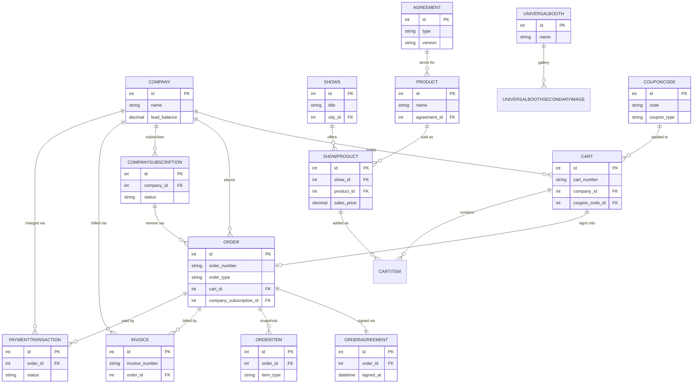

</details>

## Commerce lifecycle flow

The end-to-end path from browsing a show's products to a fully-paid, fulfilled order.


<details>
<summary>Mermaid source</summary>

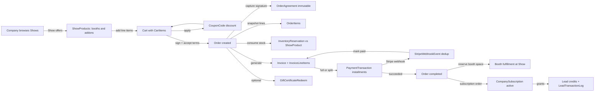

</details>

## Detailed cluster diagrams

### Orders & checkout

`Cart` is the working proposal/contract. It belongs to a Company (`onDelete: Cascade`), may carry a parent cart (self-join, SetNull, for the deferred Booth-Build upsell), an applied `CouponCode` (SetNull), and an `assigned_sales_rep_id` User (SetNull). Its `CartItems` are booth/add-on/fee lines tied to a `ShowProduct`; CartItems nest under a parent CartItem (Cascade) so add-ons live under their booth line.

On signature the Cart becomes exactly **one** `Order` — enforced by the unique `cart_id` on `orders` (one-to-one, SetNull). The Order is the transactional core:
- **Company** many-to-one, Cascade.
- **OrderAgreement** one-to-one via unique `order_id` (Cascade) — an immutable, compliance-grade signature snapshot (signer name, signature data, IP/user-agent, terms_version). Never updated or deleted in normal operation.
- **OrderItem** one-to-many (Cascade) — price/quantity snapshots; each item points at exactly one of Product / SubscriptionPlan / PplAddonPackage / ShowProduct depending on `item_type`, all SetNull so catalog deletions don't orphan order history.
- **Invoice** one-to-many (SetNull) — an Order can produce several invoices (initial + renewals); invoices can even predate the Order (nullable `order_id`).
- **PaymentTransaction** one-to-many (Cascade) — one row for full payment, N rows for split installments.
- **InventoryReservation** one-to-many (SetNull) — stock consumed at signature.
- **sales_person_id** User many-to-one, **Restrict** — you cannot delete a sales user who has orders.

`InventoryReservation` is an append-only stock ledger: many-to-one to ShowProduct (Restrict — protects the ledger), Cart (Cascade), CartItem (Cascade), and Order (SetNull, cleared when an order is canceled to release the hold).


<details>
<summary>Mermaid source</summary>

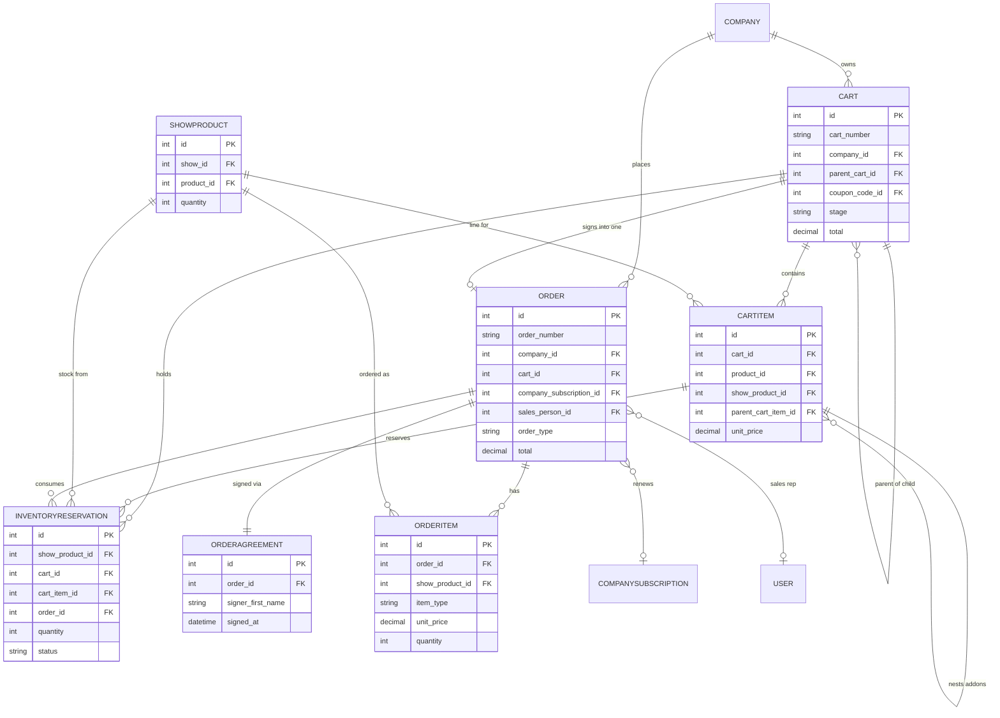

</details>

### Payments & billing

This cluster tracks money against the Order. `PaymentTransaction` is one row per installment, carrying the Stripe PaymentIntent lifecycle, retry/backoff state, and `idempotency_key`. It is many-to-one to Order (Cascade) and Company (Cascade, denormalized for cron speed), and many-to-one to Invoice (SetNull, linked by webhook after the invoice exists).

`Invoice` is the billing document (dual Stripe + QuickBooks sync). It is many-to-one to Order (SetNull) and Company (Cascade), owns `InvoiceLineItem` rows (Cascade), and receives PaymentTransactions and LeadTransactionLog audit links (both SetNull).

The PPL subscription side: `SubscriptionPlan` defines tiers (Restrict on CompanySubscription — plans in use can't be deleted) and owns `SubscriptionPlanFeature` rows (Cascade). `CompanySubscription` is a Company's live subscription (Company Cascade, Plan Restrict, PaymentMethod SetNull) and is the hub for renewal Orders, distributed Leads, and `LeadTransactionLog` credit entries (all SetNull). `PaymentMethod` stores Stripe cards per Company (Cascade). `StripeWebhookEvent` is a standalone idempotency ledger with no relations. `CompanyStripeAccount` links a Company to its Stripe customer id (Cascade).


<details>
<summary>Mermaid source</summary>

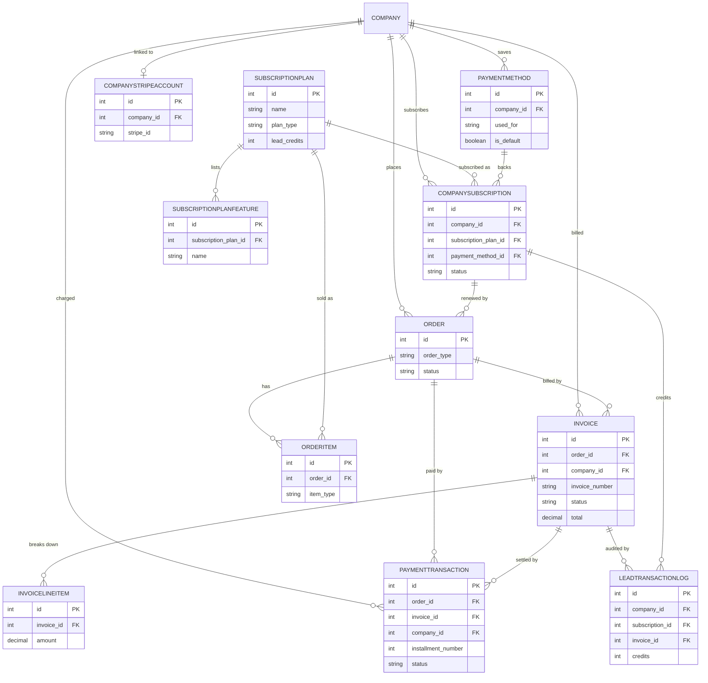

</details>

### Shows / events & booths

`Shows` is the event, scoped by `City`, `ShowClass`, and `PriceTier` (all many-to-one, Cascade). A Show offers products through `ShowProduct` — the junction of a Show and a `Product` with show-specific quantity and pricing (composite unique `show_id, product_id`). ShowProduct is what gets added to carts and orders and what inventory counts against.

`Product` is the reusable master backing booths, workshop pavilions, sponsorships, and add-ons, typed via the self-referential `ProductType` hierarchy (Restrict throughout). Pricing has two models: **flat** (`ProductPriceTier` = Product × PriceTier) and **booth-size-based** (`ProductBoothSizePrice` = add-on Product × booth-size Product × PriceTier, and at show level `BoothSizeBasedShowProductPrices`). A Product may reference an `Agreement` (SetNull) for terms required before purchase.

`UniversalBooth` is a separate, show-agnostic booth catalog (for discovery) with its own ordered `UniversalBoothSecondaryImage` gallery (Cascade) — distinct from Product booth records. `Attendee` joins shows via `AttendeeShow` (composite unique `attendee_id, show_id`).


<details>
<summary>Mermaid source</summary>

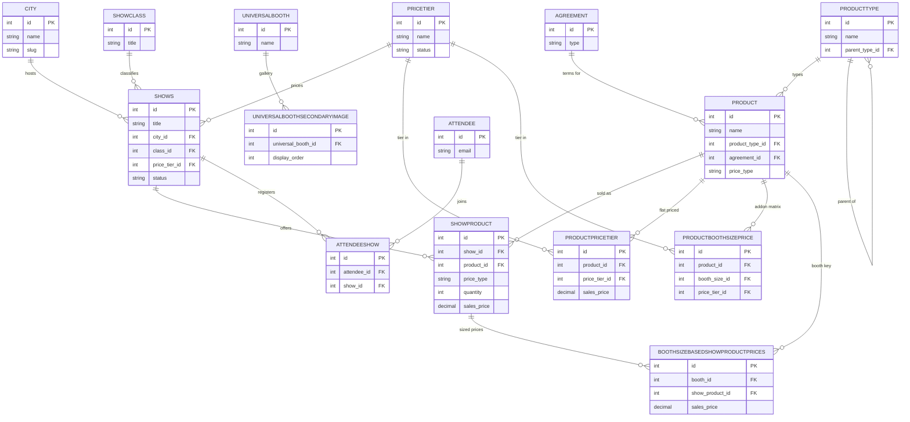

</details>

### Agreements, coupons & discounts

`Agreement` holds versioned legal templates (`ppl_terms_of_use`, `booth_terms_of_use`). Products reference an Agreement; when terms change a new Agreement row is inserted and the old soft-deleted, so historical `OrderAgreement` signatures keep their original `terms_version`. `OrderAgreement` is the per-order, immutable signature record (one-to-one with Order, Cascade).

`CouponCode` is the promo master (percentage, fixed, free product, BOGO, free leads, bundle, booth fee waiver), soft-deleted and scoped through three include/exclude junctions — `CouponProducts`, `CouponCities`, `CouponShows` (all Cascade). It optionally references a `reward_product_id` (SetNull) and `created_by` User (SetNull), and is applied to `Cart`s (SetNull). `CouponAuditLog` is an immutable ledger of every coupon mutation/redemption, many-to-one to CouponCode (Cascade), Order (SetNull, the redemption order), and the performing User (Cascade).


<details>
<summary>Mermaid source</summary>

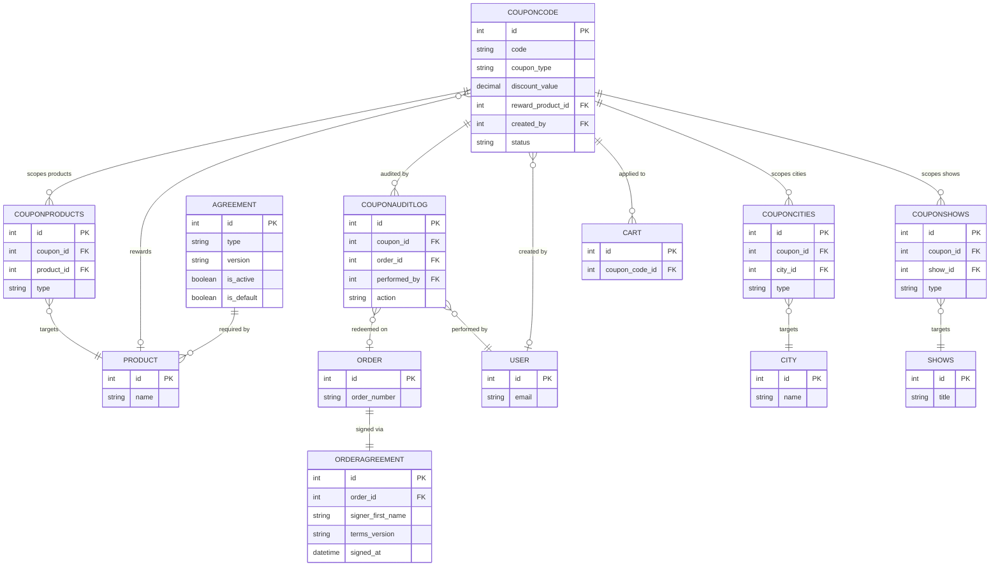

</details>

### Supporting actors & parties

`Company` is the root commercial entity and cascades to orders, subscriptions, invoices, payments, payment methods, carts, leads, gift certificates, and PPL account history. `Exhibitor` is the one-per-company login actor (unique `company_id`, Cascade). `User` is admin/sales staff — referenced as order sales rep (Restrict), cart sales rep (SetNull), coupon creator (SetNull), and across audit logs.

PPL matching uses `Attendee` (classified by `Industry`, segmented by `Category` via `CompanyCategory`/`CompanyIndustry` junctions). A matched attendee becomes a `Lead` (Company + Attendee, Cascade; CompanySubscription snapshot SetNull). `GiftCertificate` templates (Restrict) are bought as `GiftCertificatePurchase` instances (Company Cascade) and applied to orders via `GiftCertificateRedeem` (Order Restrict — can't delete an order with a redemption against it). `PPLCompanyAccountHistory` is an append-only audit of account events linking Company (Cascade) to the relevant Order, User, Subscription, Plan, and Invoice (all SetNull).


<details>
<summary>Mermaid source</summary>

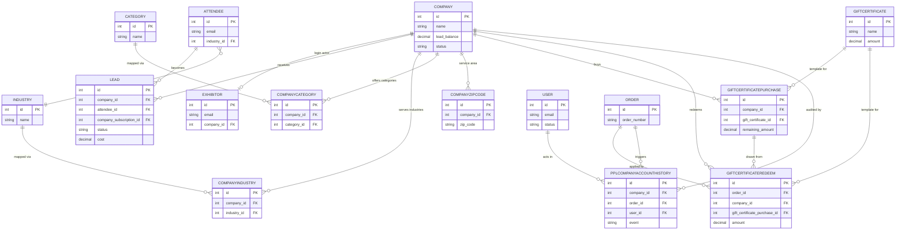

</details>

## How to regenerate

The `.mmd` files in `diagrams/` are the editable Mermaid sources. To re-render after editing (requires Node + a Chrome/Chromium install):

```bash
npx @mermaid-js/mermaid-cli -i diagrams/00-overview.mmd -o diagrams/00-overview.svg -b white
# repeat per file, or loop over diagrams/*.mmd
```

On macOS, point Puppeteer at the system Chrome with a config file (`{"executablePath": "/Applications/Google Chrome.app/Contents/MacOS/Google Chrome"}`) passed via `-p`.

---

*Generated from the Prisma schema; reflects the model graph as of the current `main` branch.*
